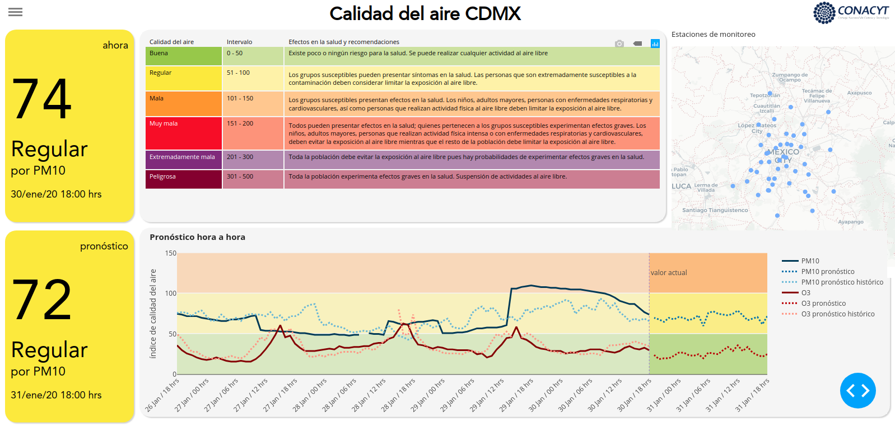

# Calidad del aire CDMX
Front end del proyecto de pronóstico de la calidad del aire en la Ciudad de México, desarrollado en 
la Coordinación de Repositorios, Investigación y Prospectiva (CRIP) del Consejo 
Nacional de Ciencia y Tecnología (CONACyT).

Este proyecto es para informar a la población del Valle de México de una 
manera amigable y directa acerca del estado de la calidad del aire en el mismo. Consta 
de un tablero que muestra el estado actual del índice de calidad del aire, y que se
actualiza hora a hora. El índice se obtiene a partir de los datos compartidos
por la Secretaría del Medio Ambiente (SEDEMA) del Gobierno de la Ciudad de México y 
se pueden encontrar [aquí](http://www.aire.cdmx.gob.mx/default.php). También usando 
algoritmos de machine learning se construyó un modelo que estima el índice de 
calidad del aire a 24 horas adelante. En el tablero se indica esa estimación así como 
una gráfica de líneas de la estimación hora a hora del índice de las partículas 
suspendidas menores a 10 micrómetros (PM10) y del ozono (O3). 

## Tecnologías usadas

Esta construído usando el framework de python [dash](https://plot.ly/dash/) y dando 
estilos con CSS y HTML.

